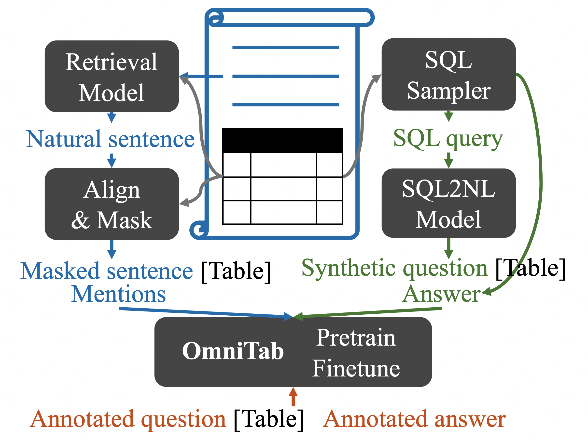

# OmniTab: Omnivorous Pretraining for Table-based QA

This repository contains the code, pre-trained models, and data for our paper [OmniTab: Pretraining with Natural and Synthetic Data for Few-shot Table-based Question Answering](https://arxiv.org/pdf/2207.03637.pdf) by Zhengbao Jiang, Yi Mao, Pengcheng He, Graham Neubig, Weizhu Chen.

## Overview

We propose an **omnivorous** pretraining approach that consumes **natural** data to endow models with the ability to understand and align natural language with tables, and **synthetic** questions to train models to perform reasoning.

<p align="center">
  
</p>

## Install environment with Conda
Create a conda env with the name `omnitab` using `./setup.sh`.

## Quick start using Transformers 🤗
You can directly load the OmniTab model (`neulab/omnitab-large-finetuned-wtq`) from HuggingFace's model hub.
```python
from transformers import AutoTokenizer, AutoModelForSeq2SeqLM
import pandas as pd

tokenizer = AutoTokenizer.from_pretrained('neulab/omnitab-large-finetuned-wtq')
model = AutoModelForSeq2SeqLM.from_pretrained('neulab/omnitab-large-finetuned-wtq')

data = {
    'year': [1896, 1900, 1904, 2004, 2008, 2012],
    'city': ['athens', 'paris', 'st. louis', 'athens', 'beijing', 'london']
}
table = pd.DataFrame.from_dict(data)

query = 'In which year did beijing host the Olympic Games?'
encoding = tokenizer(table=table, query=query, return_tensors='pt')

outputs = model.generate(**encoding)

print(tokenizer.batch_decode(outputs, skip_special_tokens=True))
# [' 2008']
```

### Model list

- Pretrained models (w/o finetuning)
  - [neulab/omnitab-large](https://huggingface.co/neulab/omnitab-large): Pretrained on natural and synthetic data generated with a SQL2NL model trained in the full setting.
  - [neulab/omnitab-large-16shot](https://huggingface.co/neulab/omnitab-large-16shot): Pretrained on natural and synthetic data generated with a SQL2NL model trained in the 16-shot setting.
  - [neulab/omnitab-large-16shot](https://huggingface.co/neulab/omnitab-large-128shot): Pretrained on natural and synthetic data generated with a SQL2NL model trained in the 128-shot setting.
  - [neulab/omnitab-large-16shot](https://huggingface.co/neulab/omnitab-large-1024shot): Pretrained on natural and synthetic data generated with a SQL2NL model trained in the 1024-shot setting.
- Finetuned models
  - [neulab/omnitab-large-finetuned-wtq](https://huggingface.co/neulab/omnitab-large-finetuned-wtq): `neulab/omnitab-large` finetuned on WTQ in the full setting.
  - [neulab/omnitab-large-16shot-finetuned-wtq-16shot](https://huggingface.co/neulab/omnitab-large-16shot-finetuned-wtq-16shot): `neulab/omnitab-large-16shot` finetuned on WTQ in the 16-shot setting.
  - [neulab/omnitab-large-128shot-finetuned-wtq-128shot](https://huggingface.co/neulab/omnitab-large-128shot-finetuned-wtq-128shot): `neulab/omnitab-large-128shot` finetuned on WTQ in the 128-shot setting.
  - [neulab/omnitab-large-1024shot-finetuned-wtq-1024shot](https://huggingface.co/neulab/omnitab-large-1024shot-finetuned-wtq-1024shot): `neulab/omnitab-large-1024shot` finetuned on WTQ in the 1024-shot setting.

### Performance reference
The table below contains the peformance of OmniTab models of various settings on validation/test split of WTQ before (`omnitab-large-{f}shot`) and after finetuning (`...-finetuned-wtq-{f}shot`).

| **Split**  |      **Validation**     |        **Validation**       |         **Test**        |           **Test**          |
|------------|:-----------------------:|:---------------------------:|:-----------------------:|:---------------------------:|
| **Model**  | `omnitab-large-{f}shot` | `...-finetuned-wtq-{f}shot` | `omnitab-large-{f}shot` | `...-finetuned-wtq-{f}shot` |
| **f=16**   |                   0.249 |                       0.220 |                   0.235 |                       0.233 |
| **f=128**  |                   0.299 |                       0.415 |                   0.294 |                       0.412 |
| **f=1024** |                   0.349 |                       0.534 |                   0.346 |                       0.526 |
| **Full**   |                   0.411 |                       0.625 |                   0.417 |                       0.633 |

## Download pretraining data and WikiTableQuestions dataset
Download the pretraining data and the WikiTableQuestions dataset from [Google Drive](https://drive.google.com/drive/u/1/folders/14IAqJb9ObVDE5oOJouhkqgd_mn11PkYY). You can download it programmatically with [gdrive](https://anaconda.org/conda-forge/gdrive) using `gdrive download -r 14IAqJb9ObVDE5oOJouhkqgd_mn11PkYY`.
It includes:
```shell
|-- pretrain_data
    |-- natural.jsonl # natural pretraining data (generated from a subset of the TAPAS pretraining data (https://github.com/google-research/tapas/blob/master/PRETRAIN_DATA.md))
    |-- synthetic.jsonl # synthetic pretraining data (generated from sql.jsonl using SQL2NL model training in the full setting)
    |-- sql.jsonl # SQL pretraining data (a subset of the TAPEX pretraining data (https://github.com/microsoft/Table-Pretraining#pre-training-corpus))
|-- wtq # the WikiTableQuestions dataset
    |-- fewshot_ids # ids of training examples used in few-shot finetuning
    |-- predictions_validation # predictions of various OmniTab models on the WTQ validation split
    |-- predictions_test # predictions of various OmniTab models on the WTQ test split
    |-- tagged # annotation files used in computing metrics
    |-- validation_ids.txt # ids of validation examples used in computing metrics
```

### Pretraining data format
Each example contains 4 fields `context`, `table`, `mentions`, and `answers`, where
- `context` is the natural language sentence relevant to the `table`.
- `table` is a 2-dimensional table with a `header` and one or multiple `rows`.
- `mentions` is a list of char-indexed spans that indicate mentions in the `context` aligned with the `table`.
- `answers` is a list of answers.

`context`, `table`, and `mentions` are required for natural pretraining examples, while `context`, `table`, and `answers` are required for synthetic pretraining examples.
Take a look at [the pretraining data processing code](https://github.com/jzbjyb/OmniTab/blob/main/data_processor.py#L353-L362) to get a better idea. 
Below is a natural pretraining example:
```shell
{
  "context": " actresses (catalan: actrius) is a 1997 catalan language spanish drama film ...", 
  "mentions": [[40, 47], [101, 113], [164, 181]], 
  "table": {
    "header": ["Directed by", "Produced by", "Written by", ...], 
    "rows": [
      ["Ventura Pons", "Ventura Pons", "Josep Maria Benet i Jornet", ...]
    ]
  },
  "answers": []
}
```

## Experiments
The scripts below by defaults use 8 GPUs and assume they are 32GB V100.
An example SLURM header is included at the top of each script if you want to submit the script using `sbatch`.
Modify these headers and the commands to activate the environemnt based on the configuration of your cluster.

### Finetuning

#### Full
Finetune pretrained OmniTab models on WikiTableQuestions dataset in the full setting:
```shell
./train_wikitablequestions.sh neulab/omnitab-large output/omnitab-large-finetuned-wtq
```
which finetunes `neulab/omnitab-large` and saves the model to `output/omnitab-large-finetuned-wtq`.
All hyperparameters are set to reproduce the experiments in the paper, and you should be able to get performance close to 0.633 as listed in the "performance reference" table

#### Few-shot
Finetune pretrained OmniTab models on WikiTableQuestions dataset in few-shot settings:
```shell
./train_wikitablequestions.sh neulab/omnitab-large-${f}shot output/omnitab-large-${f}shot-finetuned-wtq-${f}shot ${f}
```
which takes the pretrained model `neulab/omnitab-large-${f}shot` and finetunes it in f-shot setting where `f=[16|32|64|128|256|512|1024]`.

### Inference
Run inference using OmniTab models on WikiTableQuestions validation or test split and save the prediction results to `outupt/predictions.txt`:
```shell
./test_wikitablequestions.sh validation|test neulab/omnitab-large-finetuned-wtq output
```

### Evaluation
We use answer accuracy (i.e., denotation accuracy) as the metric and the numbers produced by `run.py` is less lenient to small variances (such as different formats of dates). To get a more accurate metric (usually higher), we use [the official WTQ evaluation script](https://github.com/ppasupat/WikiTableQuestions/blob/master/evaluator.py) and [modifies it slightly](https://github.com/jzbjyb/OmniTab/blob/main/evaluator.py#L387-L390) to handle predictions from generative models which are a single string potentially containing multiple answers concatenated by a separator.
```shell
python evaluator.py --split test omnitab_download/wtq/predictions_test/omnitab-large-finetuned-wtq.txt
python evaluator.py --split validation omnitab_download/wtq/predictions_validation/omnitab-large-finetuned-wtq.txt
```

### Pretraining
The best OmniTab model is initialized with `microsoft/tapex-large`, and continuously pretrained on both natural data, synthetic data, and SQL data in `omnitab_download/pretrain_data`:
```shell
./pretrain.sh omnitab_download/pretrain_data microsoft/tapex-large output/omnitab-large
```
Hyperparameters are the same as the ones used in the paper.

## Reference

```bibtex
@inproceedings{jiang-etal-2022-omnitab,
  title = "{O}mni{T}ab: Pretraining with Natural and Synthetic Data for Few-shot Table-based Question Answering",
  author = "Jiang, Zhengbao and Mao, Yi and He, Pengcheng and Neubig, Graham and Chen, Weizhu",
  booktitle = "Proceedings of the 2022 Conference of the North American Chapter of the Association for Computational Linguistics: Human Language Technologies",
  month = jul,
  year = "2022",
}
```

## Acknowledgement
The codebase is inspired by and based on [TAPEX](https://github.com/microsoft/Table-Pretraining) and [its Huggingface version](https://github.com/huggingface/transformers/tree/main/examples/research_projects/tapex), which is well-organized and easy to use.
Take a look their repositories if you want to explore more details!
